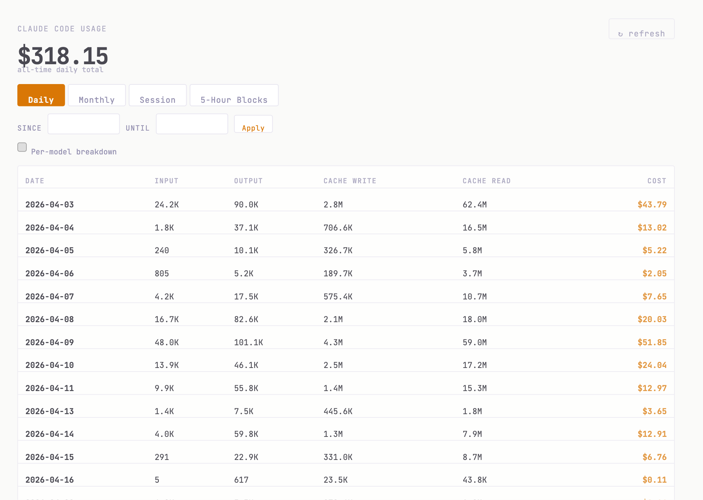
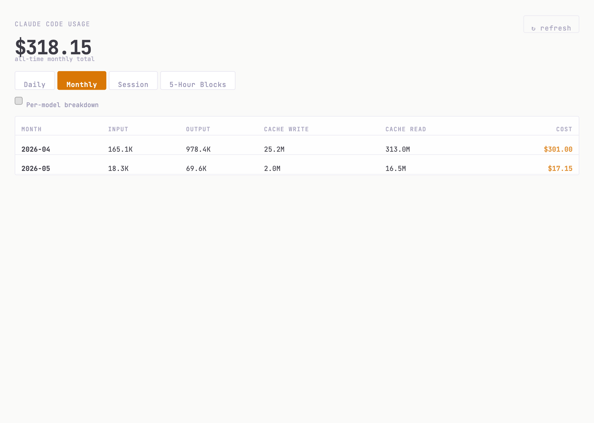
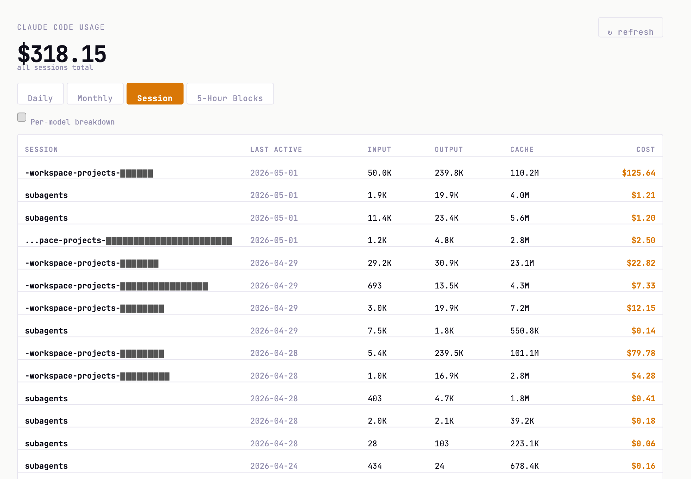
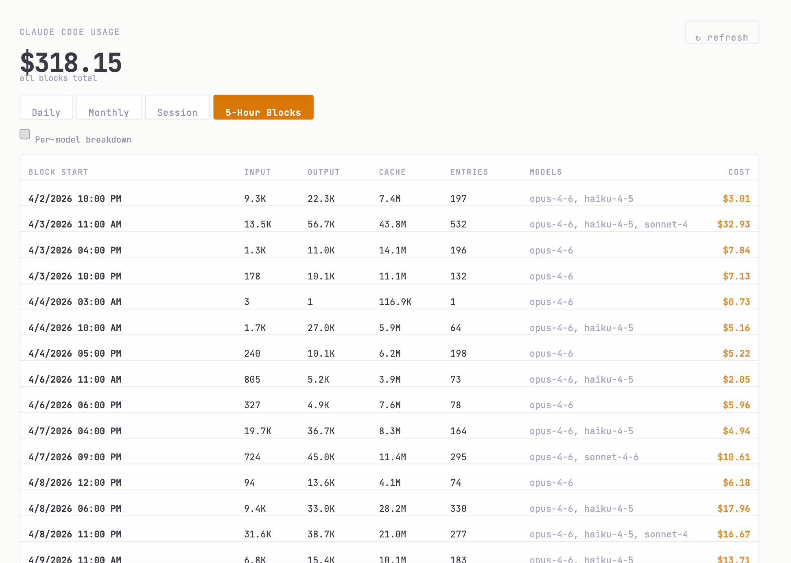

# Claude Code Cost

A CloudCLI UI plugin that displays Claude Code token usage and costs via [ccusage](https://github.com/ryoppippi/ccusage).

## Install

**Option A — via CloudCLI UI:**
Open **Settings > Plugins**, paste this repository's Git URL, and click **Install**.

**Option B — manual:**
```bash
git clone <repo-url> ~/.claude-code-ui/plugins/ccusage
cd ~/.claude-code-ui/plugins/ccusage
npm install
npm run build
```

## Screenshots

| Daily | Monthly |
|:---:|:---:|
|  |  |

| Session | 5-Hour Blocks |
|:---:|:---:|
|  |  |

## Requirements

- **Node.js** (for `npx` to run ccusage)
- **ccusage** reads from `~/.claude/projects/`, so the plugin only sees usage from the same user account that runs CloudCLI.

## License

MIT
